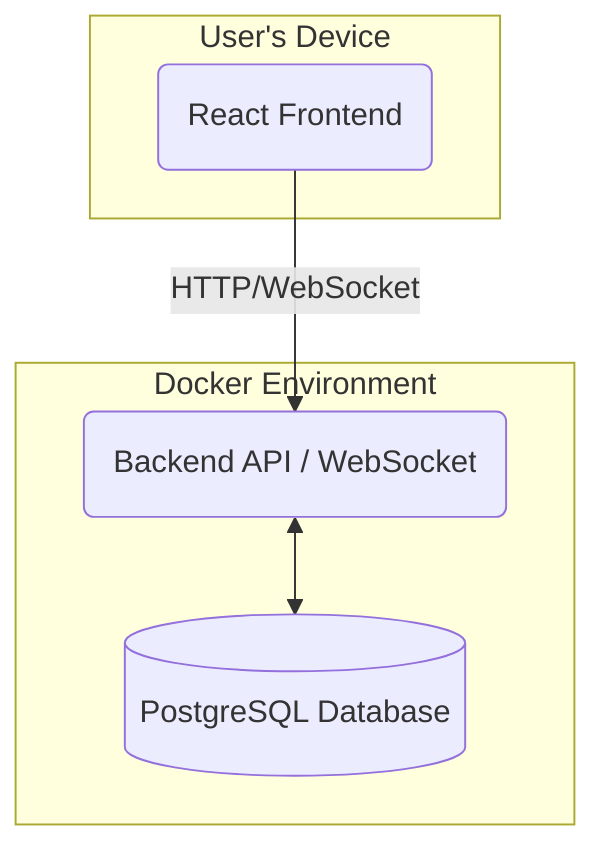
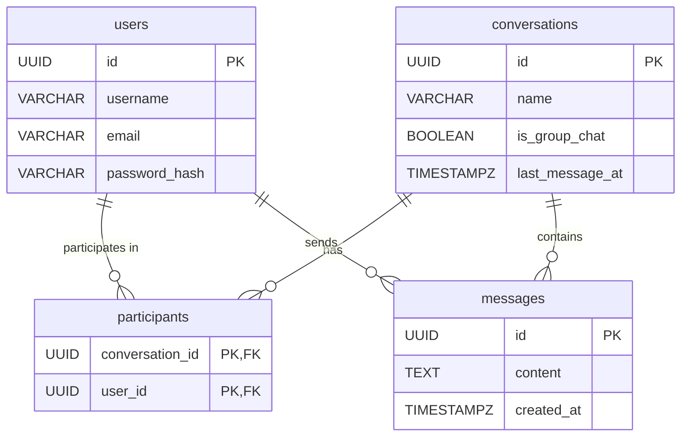

# ChatFlow: Technical Architecture & System Design

This document outlines the architectural decisions, technology stack, and scaling strategy for the ChatFlow messaging application.

---

## 1. High-Level System Design

The system is designed as a classic three-tier architecture, containerized with Docker for consistency and ease of deployment. The core components are the client (React Frontend), a stateless API Backend with an integrated WebSocket manager for real-time communication, and a relational database.

The diagram below represents the simplified local development and initial deployment setup.

* **Client (React Frontend):** A single-page application (SPA) that communicates with the backend via a RESTful API (for fetching data and sending commands) and a WebSocket connection (for real-time messages).
* **Backend Service (Python/FastAPI):** A single, containerized service that handles all business logic.
    * **REST API:** Manages user authentication, profiles, conversation history, etc.
    * **WebSocket Gateway:** Manages persistent WebSocket connections for real-time message delivery.
* **Database (PostgreSQL):** The primary data store for all persistent data, running in its own container.

---

## 2. Technology Choices & Rationale

| Component | Technology | Rationale |
| :--- | :--- | :--- |
| **Frontend** | **React** | A powerful, component-based library for building interactive UIs. Its vast ecosystem and developer community make it a robust choice. |
| **Backend** | **Python & FastAPI** | Python is excellent for rapid development. FastAPI provides incredibly high performance (on par with NodeJS), automatic API documentation (Swagger/OpenAPI), data validation via Pydantic, and native support for asynchronous operations, including WebSockets. |
| **Database** | **PostgreSQL** | A powerful, open-source object-relational database system with a strong reputation for reliability, feature robustness, and performance. It's ideal for handling the relational data of users, conversations, and messages. |
| **Real-time** | **WebSockets** | Provides a full-duplex, persistent communication channel between the client and server. This is far more efficient and scalable for a chat application than alternatives like long-polling or Server-Sent Events (SSE), as it minimizes latency and overhead. |
| **Containerization**| **Docker & Docker Compose**| Ensures a consistent and reproducible environment for development, testing, and deployment. `docker-compose` simplifies the local setup to a single command. |
| **Authentication**| **JWT (JSON Web Tokens)**| JWTs are a stateless, standard way to handle authentication in RESTful APIs. Once a user logs in, the client stores the token and sends it with each subsequent request, allowing the backend to scale horizontally without needing a shared session store. |

---

## 3. Database Schema Design

The schema is designed to be normalized to reduce data redundancy and ensure integrity. It revolves around users, conversations, and the messages within them.

**Tables:**

1.  `users`
    * `id` (UUID, Primary Key)
    * `username` (VARCHAR, Unique, Not Null)
    * `email` (VARCHAR, Unique, Not Null)
    * `password_hash` (VARCHAR, Not Null)
    * `full_name` (VARCHAR, Nullable)
    * `avatar_url` (VARCHAR, Nullable)
    * `created_at` (TIMESTAMPZ, Default: NOW())

2.  `conversations`
    * `id` (UUID, Primary Key)
    * `name` (VARCHAR, Nullable - for group chats)
    * `is_group_chat` (BOOLEAN, Default: false)
    * `created_at` (TIMESTAMPZ, Default: NOW())
    * `last_message_at` (TIMESTAMPZ, Nullable - for sorting)

3.  `participants` (Junction Table)
    * `conversation_id` (UUID, Foreign Key -> `conversations.id`, Part of Composite PK)
    * `user_id` (UUID, Foreign Key -> `users.id`, Part of Composite PK)
    * `joined_at` (TIMESTAMPZ, Default: NOW())

4.  `messages`
    * `id` (UUID, Primary Key)
    * `conversation_id` (UUID, Foreign Key -> `conversations.id`)
    * `sender_id` (UUID, Foreign Key -> `users.id`)
    * `content` (TEXT, Not Null)
    * `created_at` (TIMESTAMPZ, Default: NOW())

**Entity-Relationship Diagram:**

---

## 4. Scaling Considerations (To 10k Concurrent Users)

To scale the initial architecture to handle 10,000 concurrent users, several components would need to be introduced:

1.  **Load Balancer:** A load balancer would be placed in front of the backend services to distribute incoming HTTP and WebSocket traffic.
2.  **Stateless Backend Services:** The API is already designed to be stateless (using JWT). This allows us to horizontally scale the backend by simply adding more container instances behind the load balancer.
3.  **Introduce a Message Broker (Redis Pub/Sub):** When a user sends a message to a scaled WebSocket service (e.g., hitting instance A), we need to deliver that message to other participants who might be connected to different instances (e.g., instance B or C).
    * Instance A would publish the message to a Redis channel (e.g., `conversation:<id>`).
    * All backend instances subscribe to these channels. Instances B and C would receive the message from Redis and forward it to their connected clients.
    * This decouples the services and allows for massive scaling.
4.  **Database Scaling:**
    * **Read Replicas:** The most immediate step. A primary database would handle all writes, and one or more read replicas would handle all read queries (e.g., fetching conversation history).
    * **Connection Pooling:** Use a connection pooler like PgBouncer to efficiently manage database connections from many backend instances.
5.  **Anticipated Bottlenecks:**
    * **Database Writes:** The `messages` table will be write-heavy. This is the primary bottleneck. Solutions include partitioning the `messages` table and eventually moving to a more write-optimized database if needed.
    * **WebSocket Connection Management:** A single server can only handle so many open connections. Scaling horizontally with a load balancer and a message broker is the primary solution.

---

## 5. Trade-offs and Key Decisions

* **Monolith vs. Microservices:** The project starts as a "structured monolith" (a single backend service with well-defined internal modules). This approach significantly reduces initial complexity and deployment overhead. The architecture is designed with clear boundaries, allowing it to be broken into microservices (e.g., `auth-service`, `messaging-service`) in the future without a complete rewrite.
* **Choice of Database:** A relational database (PostgreSQL) was chosen over NoSQL. While NoSQL databases can offer easier horizontal scaling for chat messages, PostgreSQL provides strong data consistency, transactional integrity, and powerful querying capabilities for the relational aspects (users, conversation participants), which are critical.
* **Real-time Communication:** WebSockets were chosen over Long Polling or Server-Sent Events (SSE).
    * **Long Polling** is inefficient, creating high server load and latency.
    * **SSE** is excellent for one-way server-to-client communication, but chat is bidirectional.
    * **WebSockets** provide the lowest latency and most efficient two-way communication channel, making them the superior choice for a real-time messaging app.
