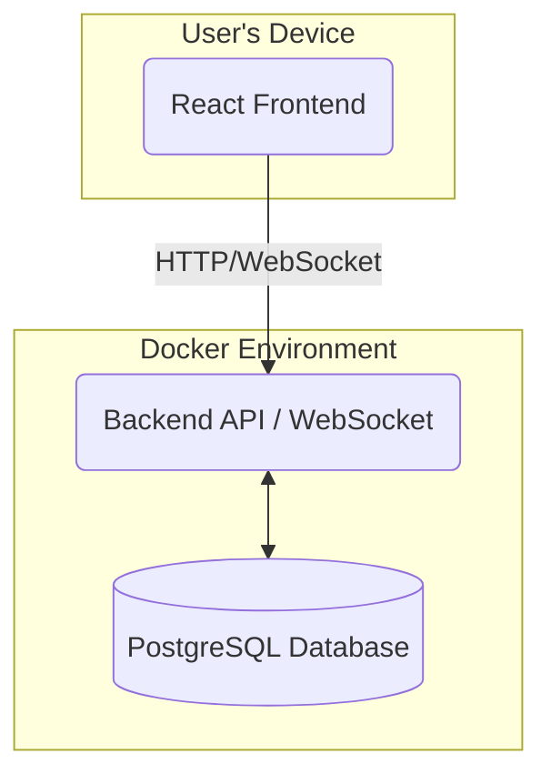
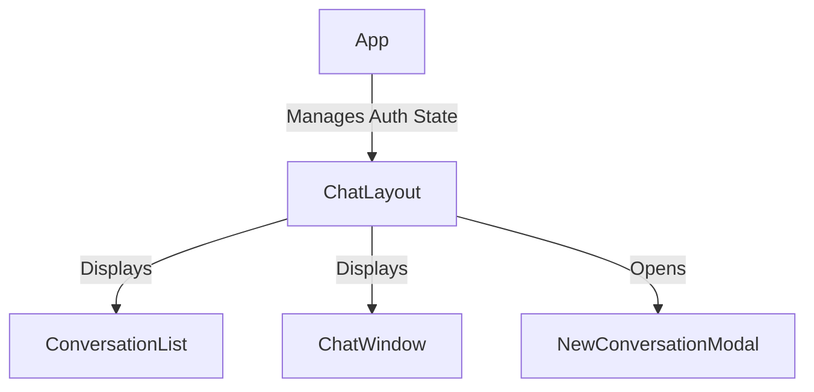
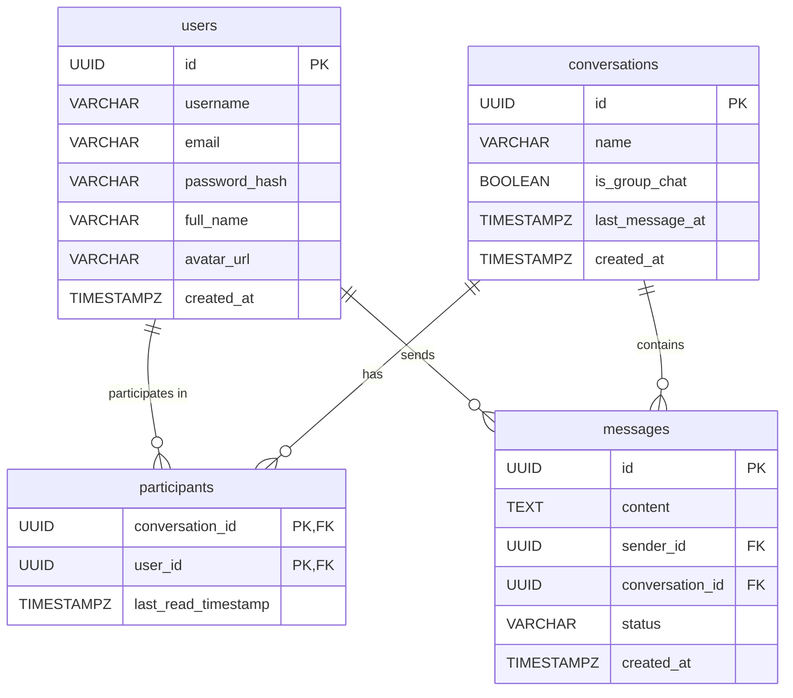

# ChatFlow - A Messaging Application

ChatFlow is a simplified, WhatsApp-like messaging application built with a React frontend, a Python (FastAPI) backend, and containerized with Docker.

---

## 1. Getting Started

### Prerequisites

You must have the following software installed on your local machine:

* **Docker Desktop:** [Download Here](https://www.docker.com/products/docker-desktop)

### How to Run the Application

The entire application stack (frontend, backend, database) can be started with a single command from the project's root directory.

1.  **Clone the repository** (if you haven't already).

2.  **Build and run the containers:**
    The first time you run this command, Docker will download the necessary base images and build your application's images.
    ```sh
    docker-compose up --build
    ```
    To run in detached mode (in the background), add the `-d` flag:
    ```sh
    docker-compose up --build -d
    ```

3.  **Access the application:**
    * **Frontend (React App):** `http://localhost:3000`
    * **Backend (API Docs):** `http://localhost:8000/docs` (Interactive Swagger UI)

4.  **Stopping the application:**
    To stop the running containers, press `Ctrl+C` in the terminal where `docker-compose` is running. If you are in detached mode, use the following command:
    ```sh
    docker-compose down
    ```

---

## 2. Running the Tests

### Backend Tests

You'll need python and pip for this step. 

Install all requirements libraries
```sh
backend_root_folder> pip install -r requirements.txt
```

Run all backend tests with the following command from the backend's root directory:
```sh
    pytest
```

### Frontend Tests
You'll need node and npm for this step.

The frontend tests use Jest and React Testing Library to verify component behavior.

1.  Navigate to the `frontend` directory:
    ```sh
    cd frontend
    ```

2.  Install dependencies (only needed the first time):
    ```sh
    npm install
    ```

3.  Run the tests in watch mode:
    ```sh
    npm test
    ```

---

## 3. High-Level Architecture

The system is a classic three-tier architecture, containerized with Docker for consistency. The core components are the React Frontend, a Python API Backend (which also manages WebSockets), and a PostgreSQL database.



---

## 4. UI Component Architecture

The frontend is structured with a parent `ChatLayout` component that manages the state and orchestrates the child components for displaying the conversation list and the active chat window.



* **`App`**: The root component. Handles routing and global authentication state.
* **`ChatLayout`**: The main container after login. Fetches the conversation list and manages which conversation is currently active.
* **`ConversationList`**: Renders the list of conversations and displays unread message indicators.
* **`ChatWindow`**: Renders the messages for the active conversation and handles real-time updates and user interactions (sending messages, search).
* **`NewConversationModal`**: A modal dialog for creating new one-on-one or group chats.

---

## 5. API Documentation

The backend exposes a RESTful API and a WebSocket endpoint. You can explore and test the REST endpoints interactively at `http://localhost:8000/docs`.

### REST Endpoints

#### Authentication (`/auth`)
* **`POST /auth/register`**: Registers a new user.
* **`POST /auth/login`**: Authenticates a user and returns a JWT access token.

#### Users (`/users`)
* **`GET /users/`**: Retrieves a list of all users, used for creating new conversations. (Requires authentication)

#### Conversations (`/conversations`)
* **`POST /`**: Creates a new one-on-one or group conversation. (Requires authentication)
* **`GET /`**: Retrieves a list of all conversations for the authenticated user, including their unread status. (Requires authentication)
* **`GET /{conversation_id}/messages`**: Fetches the message history for a specific conversation. (Requires authentication and participation)
* **`POST /{conversation_id}/read`**: Marks all messages in a conversation as read by the current user. (Requires authentication)

### WebSocket Endpoint

* **`WS /ws/{conversation_id}/{token}`**
    * Establishes a WebSocket connection for real-time communication within a specific conversation.
    * **`conversation_id`**: The ID of the chat to connect to.
    * **`token`**: The user's JWT access token for authentication.
    * **Functionality**: Handles real-time message delivery, online/offline status updates, and read receipts.

---

## 6. Technology Choices & Rationale

| Component         | Technology                | Rationale                                                                                                                                                                                                                         |
| ----------------- | ------------------------- | --------------------------------------------------------------------------------------------------------------------------------------------------------------------------------------------------------------------------------- |
| **Frontend** | **React** | A powerful, component-based library for building interactive UIs. Its vast ecosystem and developer community make it a robust choice.                                                                                             |
| **Backend** | **Python & FastAPI** | Python is excellent for rapid development. FastAPI provides incredibly high performance, automatic API documentation, data validation via Pydantic, and native support for asynchronous operations, including WebSockets. |
| **Database** | **PostgreSQL** | A powerful, open-source object-relational database system with a strong reputation for reliability and feature robustness. It's ideal for handling the relational data of users, conversations, and messages.       |
| **Real-time** | **WebSockets** | Provides a full-duplex, persistent communication channel between the client and server. This is far more efficient and scalable for a chat application than alternatives like long-polling.                                         |
| **Containerization**| **Docker & Docker Compose**| Ensures a consistent and reproducible environment for development, testing, and deployment. `docker-compose` simplifies the local setup to a single command.                                                                     |
| **Authentication**| **JWT (JSON Web Tokens)** | JWTs are a stateless, standard way to handle authentication in RESTful APIs. Once a user logs in, the client stores the token and sends it with each subsequent request.                                                        |

---

## 7. Database Schema

The schema is designed to be normalized to reduce data redundancy and ensure integrity.

## 4. Scaling Considerations (To 10k Concurrent Users)

To scale the initial architecture to handle 10,000 concurrent users, several components would need to be introduced:

1.  **Load Balancer:** A load balancer would be placed in front of the backend services to distribute incoming HTTP and WebSocket traffic.
2.  **Stateless Backend Services:** The API is already designed to be stateless (using JWT). This allows us to horizontally scale the backend by simply adding more container instances behind the load balancer.
3.  **Introduce a Message Broker (Redis Pub/Sub):** When a user sends a message to a scaled WebSocket service (e.g., hitting instance A), we need to deliver that message to other participants who might be connected to different instances (e.g., instance B or C).
    * Instance A would publish the message to a Redis channel (e.g., `conversation:<id>`).
    * All backend instances subscribe to these channels. Instances B and C would receive the message from Redis and forward it to their connected clients.
    * This decouples the services and allows for massive scaling.
4.  **Database Scaling:**
    * **Read Replicas:** The most immediate step. A primary database would handle all writes, and one or more read replicas would handle all read queries (e.g., fetching conversation history).
    * **Connection Pooling:** Use a connection pooler like PgBouncer to efficiently manage database connections from many backend instances.
5.  **Anticipated Bottlenecks:**
    * **Database Writes:** The `messages` table will be write-heavy. This is the primary bottleneck. Solutions include partitioning the `messages` table and eventually moving to a more write-optimized database if needed.
    * **WebSocket Connection Management:** A single server can only handle so many open connections. Scaling horizontally with a load balancer and a message broker is the primary solution.

---

## 5. Trade-offs and Key Decisions

* **Monolith vs. Microservices:** The project starts as a "structured monolith" (a single backend service with well-defined internal modules). This approach significantly reduces initial complexity and deployment overhead. The architecture is designed with clear boundaries, allowing it to be broken into microservices (e.g., `auth-service`, `messaging-service`) in the future without a complete rewrite.
* **Choice of Database:** A relational database (PostgreSQL) was chosen over NoSQL. While NoSQL databases can offer easier horizontal scaling for chat messages, PostgreSQL provides strong data consistency, transactional integrity, and powerful querying capabilities for the relational aspects (users, conversation participants), which are critical.
* **Real-time Communication:** WebSockets were chosen over Long Polling or Server-Sent Events (SSE).
    * **Long Polling** is inefficient, creating high server load and latency.
    * **SSE** is excellent for one-way server-to-client communication, but chat is bidirectional.
    * **WebSockets** provide the lowest latency and most efficient two-way communication channel, making them the superior choice for a real-time messaging app.
