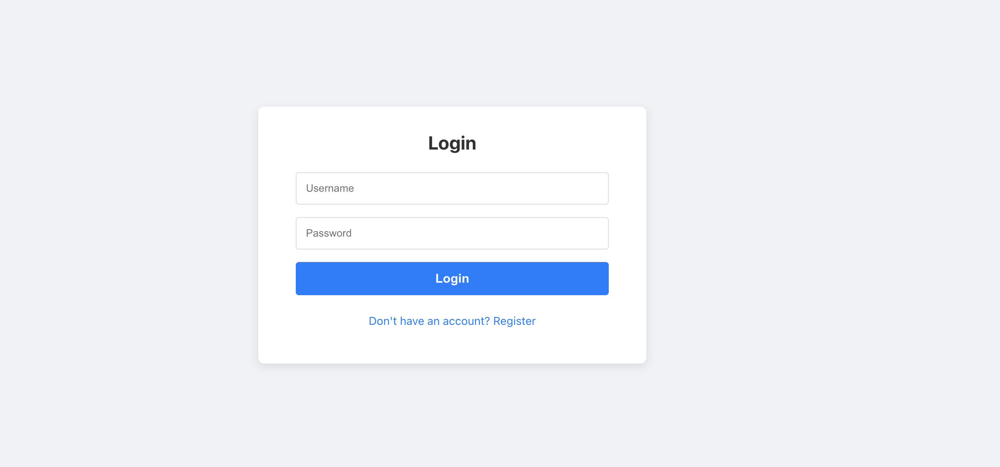
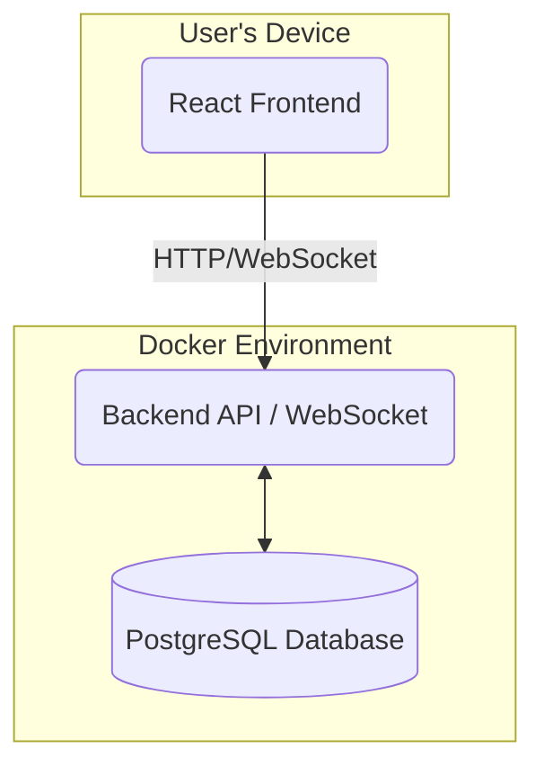
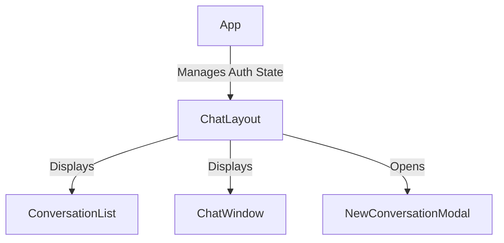
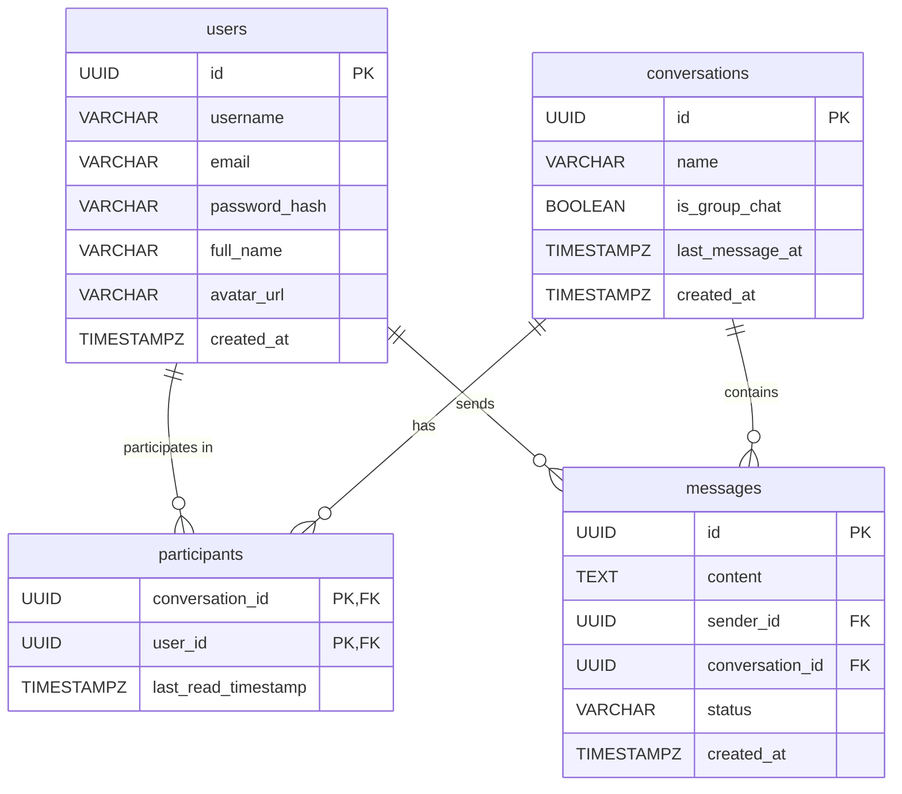

# ChatFlow - A Messaging Application

ChatFlow is a simplified, WhatsApp-like messaging application built with a React frontend, a Python (FastAPI) backend, and containerized with Docker.

---

## 1. Getting Started

### Prerequisites

You must have the following software installed on your local machine:

* **Docker Desktop:** [Download Here](https://www.docker.com/products/docker-desktop)

### How to Run the Application

The entire application stack (frontend, backend, database) can be started with a single command from the project's root directory.

1.  **Clone the repository** (if you haven't already).

2.  **Build and run the containers:**
    The first time you run this command, Docker will download the necessary base images and build your application's images.
    ```sh
    docker-compose up --build
    ```
    To run in detached mode (in the background), add the `-d` flag:
    ```sh
    docker-compose up --build -d
    ```

3.  **Access the application:**
    * **Frontend (React App):** `http://localhost:3000`. Should look like this. 
    
    * **Backend (API Docs):** `http://localhost:8000/docs` (Interactive Swagger UI)

4.  **Stopping the application:**
    To stop the running containers, press `Ctrl+C` in the terminal where `docker-compose` is running. If you are in detached mode, use the following command:
    ```sh
    docker-compose down
    ```

---

## 2. Running the Tests

### Backend Tests

You'll need python and pip for this step. 

Install all requirements libraries
```sh
backend_root_folder> pip install -r requirements.txt
```

Run all backend tests with the following command from the backend's root directory:
```sh
    pytest
```
#### Backend Tests added for based criticality
*`security_test`*\
*`api_conversations_test`*\
*`api_auth_test`*\
*`websocket_test`*

### Frontend Tests
You'll need node and npm for this step.

The frontend tests use Jest and React Testing Library to verify component behavior.

1.  Navigate to the `frontend` directory:
    ```sh
    cd frontend
    ```

2.  Install dependencies (only needed the first time):
    ```sh
    npm install
    ```

3.  Run the tests in watch mode:
    ```sh
    npm test
    ```
#### Frontend Tests added for based criticality
*`auth.test`*\
*`chatwindow.test`*

---

## 3. High-Level Architecture

The system is a classic three-tier architecture, containerized with Docker for consistency. The core components are the React Frontend, a Python API Backend (which also manages WebSockets), and a PostgreSQL database.



---

## 4. UI Component Architecture

The frontend is structured with a parent `ChatLayout` component that manages the state and orchestrates the child components for displaying the conversation list and the active chat window.



* **`App`**: The root component. Handles routing and global authentication state.
* **`ChatLayout`**: The main container after login. Fetches the conversation list and manages which conversation is currently active.
* **`ConversationList`**: Renders the list of conversations and displays unread message indicators.
* **`ChatWindow`**: Renders the messages for the active conversation and handles real-time updates and user interactions (sending messages, search).
* **`NewConversationModal`**: A modal dialog for creating new one-on-one or group chats.

---

## 5. API Documentation

The backend exposes a RESTful API and a WebSocket endpoint. You can explore and test the REST endpoints interactively at `http://localhost:8000/docs`.

### REST Endpoints

#### Authentication (`/auth`)
* **`POST /auth/register`**: Registers a new user.
* **`POST /auth/login`**: Authenticates a user and returns a JWT access token.

#### Users (`/users`)
* **`GET /users/`**: Retrieves a list of all users, used for creating new conversations. (Requires authentication)

#### Conversations (`/conversations`)
* **`POST /`**: Creates a new one-on-one or group conversation. (Requires authentication)
* **`GET /`**: Retrieves a list of all conversations for the authenticated user, including their unread status. (Requires authentication)
* **`GET /{conversation_id}/messages`**: Fetches the message history for a specific conversation. (Requires authentication and participation)
* **`POST /{conversation_id}/read`**: Marks all messages in a conversation as read by the current user. (Requires authentication)

### WebSocket Endpoint

* **`WS /ws/{conversation_id}/{token}`**
    * Establishes a WebSocket connection for real-time communication within a specific conversation.
    * **`conversation_id`**: The ID of the chat to connect to.
    * **`token`**: The user's JWT access token for authentication.
    * **Functionality**: Handles real-time message delivery, online/offline status updates, and read receipts.

---

## 6. Technology Choices & Rationale

| Component         | Technology                | Rationale                                                                                                                                                                                                                         |
| ----------------- | ------------------------- | --------------------------------------------------------------------------------------------------------------------------------------------------------------------------------------------------------------------------------- |
| **Frontend** | **React** | A powerful, component-based library for building interactive UIs. Its vast ecosystem and developer community make it a robust choice.                                                                                             |
| **Backend** | **Python & FastAPI** | Python is excellent for rapid development. FastAPI provides incredibly high performance, automatic API documentation, data validation via Pydantic, and native support for asynchronous operations, including WebSockets. |
| **Database** | **PostgreSQL** | A powerful, open-source object-relational database system with a strong reputation for reliability and feature robustness. It's ideal for handling the relational data of users, conversations, and messages.       |
| **Real-time** | **WebSockets** | Provides a full-duplex, persistent communication channel between the client and server. This is far more efficient and scalable for a chat application than alternatives like long-polling.                                         |
| **Containerization**| **Docker & Docker Compose**| Ensures a consistent and reproducible environment for development, testing, and deployment. `docker-compose` simplifies the local setup to a single command.                                                                     |
| **Authentication**| **JWT (JSON Web Tokens)** | JWTs are a stateless, standard way to handle authentication in RESTful APIs. Once a user logs in, the client stores the token and sends it with each subsequent request.                                                        |

---

## 7. Database Schema

The schema is designed to be normalized to reduce data redundancy and ensure integrity.

## 4. Scaling Considerations (To 10k Concurrent Users)

To scale the initial architecture to handle 10,000 concurrent users, several components would need to be introduced:

1.  **Load Balancer:** A load balancer would be placed in front of the backend services to distribute incoming HTTP and WebSocket traffic.
2.  **Stateless Backend Services:** The API is already designed to be stateless (using JWT). This allows us to horizontally scale the backend by simply adding more container instances behind the load balancer.
3.  **Introduce a Message Broker (Redis Pub/Sub):** When a user sends a message to a scaled WebSocket service (e.g., hitting instance A), we need to deliver that message to other participants who might be connected to different instances (e.g., instance B or C).
    * Instance A would publish the message to a Redis channel (e.g., `conversation:<id>`).
    * All backend instances subscribe to these channels. Instances B and C would receive the message from Redis and forward it to their connected clients.
    * This decouples the services and allows for massive scaling.
4.  **Database Scaling:**
    * **Read Replicas:** The most immediate step. A primary database would handle all writes, and one or more read replicas would handle all read queries (e.g., fetching conversation history).
    * **Connection Pooling:** Use a connection pooler like PgBouncer to efficiently manage database connections from many backend instances.
5.  **Anticipated Bottlenecks:**
    * **Database Writes:** The `messages` table will be write-heavy. This is the primary bottleneck. Solutions include partitioning the `messages` table and eventually moving to a more write-optimized database if needed.
    * **WebSocket Connection Management:** A single server can only handle so many open connections. Scaling horizontally with a load balancer and a message broker is the primary solution.

---

## 5. Trade-offs and Key Decisions

* **Monolith vs. Microservices:** The project starts as a "structured monolith" (a single backend service with well-defined internal modules). This approach significantly reduces initial complexity and deployment overhead. The architecture is designed with clear boundaries, allowing it to be broken into microservices (e.g., `auth-service`, `messaging-service`) in the future without a complete rewrite.
* **Choice of Database:** A relational database (PostgreSQL) was chosen over NoSQL. While NoSQL databases can offer easier horizontal scaling for chat messages, PostgreSQL provides strong data consistency, transactional integrity, and powerful querying capabilities for the relational aspects (users, conversation participants), which are critical.
* **Real-time Communication:** WebSockets were chosen over Long Polling or Server-Sent Events (SSE).
    * **Long Polling** is inefficient, creating high server load and latency.
    * **WebSockets** provide the lowest latency and most efficient two-way communication channel, making them the superior choice for a real-time messaging app.

---

## 6. With More Time

Given more time, the following improvements would be prioritized to enhance the application's scalability, feature set, and robustness.

### Database Optimization
* **Indexing**: Add database indexes to foreign key columns like `messages.sender_id` and `messages.conversation_id` to significantly speed up message retrieval. A composite index on `(user_id, conversation_id)` in the `participants` table would also improve performance.
* **Search Strategy**: The current client-side search is effective for loaded messages but doesn't cover the full chat history. A server-side search is challenging due to encryption. A robust solution would involve a dedicated, secure search index for non-sensitive metadata, but this requires significant architectural planning.

### Real-Time Enhancements
* **Scalable Presence System**: The current in-memory online status tracking does not scale beyond a single backend instance and would break behind a load balancer. The first step to scaling would be to integrate **Redis Pub/Sub** to broadcast WebSocket events (like messages, online status, and read receipts) across all backend instances.
* **"User is Typing" Indicator**: Implement a "user is typing..." indicator by sending transient WebSocket events, which would greatly improve the real-time user experience.
* **Real-time Read Receipts**: The `mark as read` functionality currently requires the client to re-fetch the conversation list to update the unread status. This could be improved by having the API endpoint also broadcast a WebSocket event (e.g., `conversation_read`) to the participants, allowing the UI to update in real-time.

### API and Backend Refinements
* **API Pagination**: The `GET /conversations/{id}/messages` endpoint currently returns all messages at once. I would implement cursor-based pagination to allow the frontend to load message history in smaller, more manageable chunks as the user scrolls.
* **Input Validation**: Add more granular validation for all API inputs to make the backend more resilient to bad data.

### Frontend Polish
* **Optimistic UI Updates**: When a user sends a message, it could be immediately displayed in the UI with a "sending..." status before the backend confirms it has been saved. This makes the interface feel much faster.
* **Better State Management**: For a larger application, I would consider integrating a dedicated state management library like Zustand or React Context for managing global state more effectively.
* **Implement avatar**.

---

## 9. Deployment Strategy

Deploying this application to a production server involves a few key steps to ensure it is secure, performant, and maintainable.

### Environment Variables

Sensitive configurations should never be hardcoded. Instead, they should be managed with environment variables.

1.  **Create a `.env` file** in the project's `backend/` directory. This file should be listed in your `.gitignore` to prevent it from being committed to version control.

    ```env
    # backend/.env
    DATABASE_URL=postgresql://user:password@db:5432/chatflowdb
    SECRET_KEY=a_very_secure_random_string_for_jwt
    ENCRYPTION_KEY=a_secure_fernet_key_generated_once
    ```

2.  **Update `docker-compose.yml`**: Modify the `docker-compose.yml` to load this `.env` file for the backend service.

    ```yaml
    # docker-compose.yml
    services:
      backend:
        env_file:
          - ./backend/.env
    # ...
    ```

### From Compose to Production Orchestration

While `docker-compose` is excellent for local development, it is not recommended for production deployments due to its lack of automatic scaling, health checks, and restart policies.

The `Dockerfile`s in the `frontend` and `backend` directories are the true source of a production deployment. These files should be used to build production-ready images that are then deployed using a container orchestration platform like **Kubernetes**, **AWS ECS**, or **Google Cloud Run**.

### Production Docker Images

For production, the `Dockerfile`s would be modified:

* **Backend (`backend/Dockerfile`)**: The `CMD` would be changed to use a production-grade web server like Gunicorn with Uvicorn workers, instead of Uvicorn's development server.
    ```dockerfile
    CMD ["gunicorn", "-k", "uvicorn.workers.UvicornWorker", "-w", "4", "-b", "0.0.0.0:8000", "app.main:app"]
    ```

* **Frontend (`frontend/Dockerfile`)**: A multi-stage build would be used. The first stage builds the static React files (`npm run build`), and the second stage copies those files into a lightweight Nginx container to serve them efficiently.

### Load Balancing and Scaling

When deploying multiple instances of the backend for high availability, the WebSocket connections must be managed carefully. The **Redis Pub/Sub** system mentioned in the "With More Time" section becomes a necessity, not just an enhancement. It ensures that a message received by one backend instance can be broadcast to a user connected to a different instance.

### HTTPS with a Reverse Proxy

The application should not be exposed directly to the internet. A reverse proxy like **Nginx** or **Caddy** should be set up on the host server or as part of the cloud infrastructure to:
* **Handle SSL/TLS Termination**: The reverse proxy will manage the HTTPS certificate (e.g., using Let's Encrypt), so your application containers can communicate over plain HTTP within the secure Docker network.
* **Proxy Requests**: It will forward incoming requests to the appropriate container (e.g., requests to `/api` go to the backend, all other requests go to the frontend).